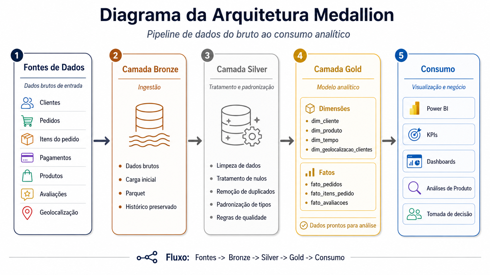
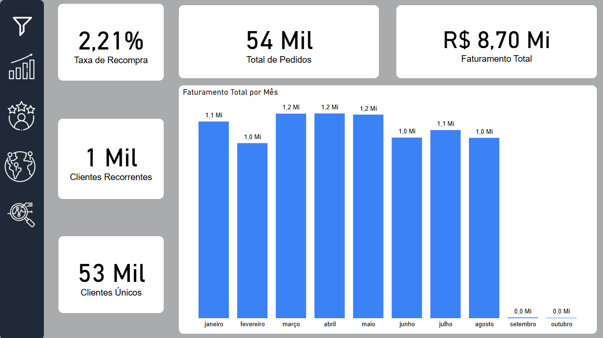
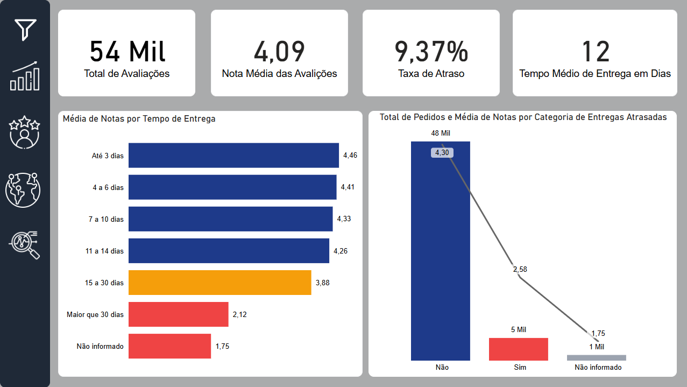
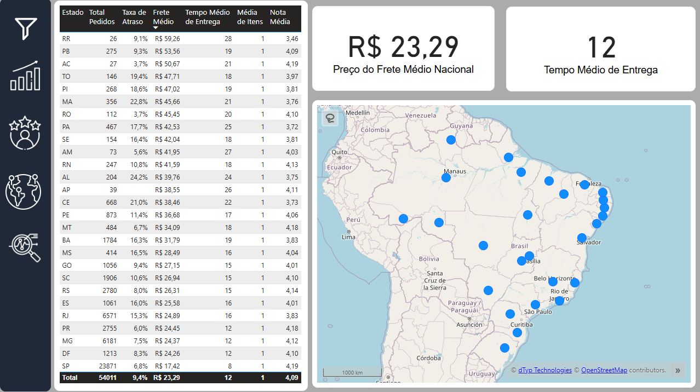
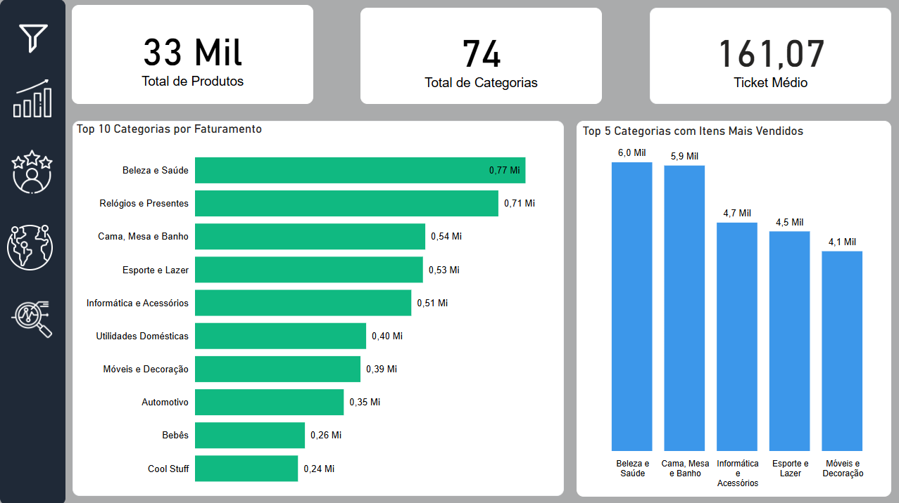
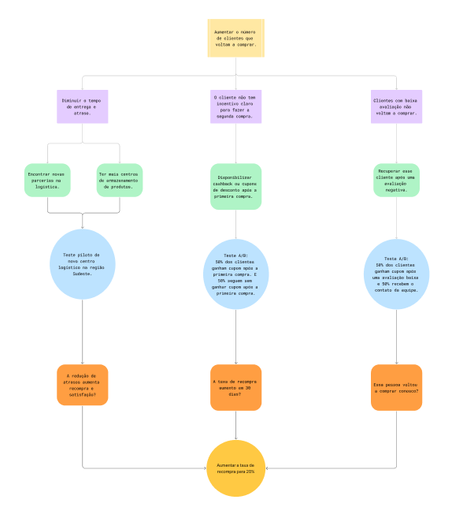
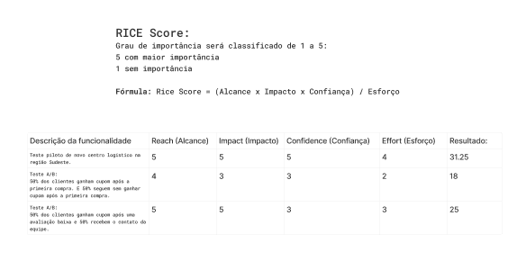

# Projeto Olist - Pipeline de Dados, Dashboard e Produto

Projeto de análise da base Olist com arquitetura Medallion, tratamento de dados em SQL/Python, modelo analítico em Power BI e etapa de produto orientada por hipóteses de negócio.

## Objetivo

O objetivo do projeto é transformar os dados brutos da Olist em uma base analítica organizada, confiável e pronta para consumo em dashboard.

A análise foi conduzida para responder perguntas sobre vendas, recompra, entrega, atrasos, satisfação, categorias, regiões e oportunidades de produto.

## Visão Geral

O projeto foi dividido em três frentes:

1. Engenharia de Dados: ingestão, tratamento e modelagem das camadas Raw, Bronze, Silver e Gold.
2. Analytics e Dashboard: criação do modelo analítico, medidas DAX e dashboard Power BI.
3. Produto e Estratégia: análise de hipóteses, árvore de oportunidades e priorização RICE.

## Arquitetura Medallion



Observação: a imagem da arquitetura Medallion foi criada com apoio do ChatGPT.

A estrutura de dados segue a arquitetura Medallion:

| Camada | Descrição |
| :--- | :--- |
| Raw | Arquivos CSV originais da base Olist. |
| Bronze | Conversão dos arquivos brutos para Parquet, preservando a estrutura original. |
| Silver | Limpeza, tipagem, padronização, tratamento de nulos e enriquecimento geográfico. |
| Gold | Tabelas fato e dimensão preparadas para análise e Power BI. |

## Estrutura do Projeto

```bash
data/
  raw/
  bronze/
  silver/
  gold/
  reference/

sql/
  bronze/
  silver/
  gold/
  exploration/

docs/
power_bi/
api_ibge.py
eda_inicial.py
pipeline_dados.py
requirements.txt
```

## Tecnologias Utilizadas

| Tecnologia | Uso |
| :--- | :--- |
| Python | Scripts auxiliares e execução do pipeline. |
| Pandas | Exploração inicial e tratamento da base de municípios do IBGE. |
| Requests | Consumo da API pública do IBGE. |
| DuckDB | Execução dos SQLs e geração dos arquivos Parquet. |
| SQL | Transformações das camadas Bronze, Silver e Gold. |
| Parquet | Armazenamento otimizado das bases tratadas. |
| Power BI | Construção do dashboard analítico. |
| Figma | Organização da etapa de produto, árvore de oportunidades e matriz RICE. |

## Pipeline de Dados

Os principais scripts do projeto são:

| Arquivo | Função |
| :--- | :--- |
| `api_ibge.py` | Consulta a API pública do IBGE, normaliza os nomes de municípios e gera `data/reference/municipios_ibge.parquet`. |
| `eda_inicial.py` | Apoia a análise exploratória inicial, verificando amostras, tipos, nulos, duplicados e estatísticas descritivas. |
| `pipeline_dados.py` | Executa os arquivos SQL em ordem para gerar as camadas Bronze, Silver e Gold. |

Para instalar as dependências:

```bash
pip install -r requirements.txt
```

Para executar o pipeline:

```bash
python api_ibge.py
python pipeline_dados.py
```

## Modelo Gold

A camada Gold foi modelada para consumo no Power BI, com tabelas fato e dimensão.

### Fatos

- `fato_pedidos`
- `fato_itens_pedido`
- `fato_pagamentos`
- `fato_avaliacoes`

### Dimensões

- `dim_cliente`
- `dim_vendedor`
- `dim_produto`
- `dim_pagamento`
- `dim_tempo`
- `dim_geolocalizacao_clientes`
- `dim_geolocalizacao_vendedores`

Os detalhes das colunas, regras de tratamento e regras de negócio estão documentados em:

- [Dicionário de Dados Bronze](docs/dicionario_dados_bronze.md)
- [Dicionário de Dados Silver](docs/dicionario_dados_silver.md)
- [Dicionário de Dados Gold](docs/dicionario_dados_gold.md)
- [Regras do Negócio](docs/regras_do_negocio.md)

## Dashboard Power BI

O dashboard foi desenvolvido no Power BI e publicado no Power BI Service.

### Página 1 - Crescimento e Retenção



### Página 2 - Entrega vs Satisfação



### Página 3 - Análise Regional



### Página 4 - Performance de Categorias



[Acessar dashboard publicado no Power BI](https://app.powerbi.com/groups/me/reports/5e4db95f-436a-4ebe-aed6-0505ad7f2556?ctid=fa79531c-8ce5-4bd3-97ee-245e6ee266b8&pbi_source=linkShare)

## Hipóteses de Negócio

As principais hipóteses analisadas foram:

- Estamos vendendo mais?
- Os clientes continuam comprando conosco?
- Clientes satisfeitos têm maior potencial de recompra?
- Os clientes que demoram para receber os produtos voltam a comprar?
- A experiência de entrega impacta diretamente a satisfação?
- Pedidos atrasados ou que demoram para chegar impactam a avaliação do cliente?
- Atrasos afetam mais algumas regiões do que outras?
- Categorias de produto têm experiências diferentes?

## Produto e Estratégia

A etapa de produto partiu da seguinte pergunta:

**Como aumentar o número de clientes que voltam a comprar?**

A partir das hipóteses de negócio, foi construída uma árvore de oportunidades e uma matriz RICE para priorizar possíveis soluções. A solução priorizada foi o teste piloto de um novo centro logístico na região Sudeste, com foco em reduzir atrasos, melhorar a experiência de entrega e aumentar a recompra.





Observação: as imagens da árvore de oportunidade e da matriz RICE foram criadas por mim no Figma.

## Documentação Complementar

- [Documento Técnico](docs/documento_tecnico.md)
- [Regras do Negócio](docs/regras_do_negocio.md)
- [Dicionário de Dados Bronze](docs/dicionario_dados_bronze.md)
- [Dicionário de Dados Silver](docs/dicionario_dados_silver.md)
- [Dicionário de Dados Gold](docs/dicionario_dados_gold.md)
- [Produto e Estratégia](docs/produto.md)
- [Guia do Dashboard](docs/guia_dashboard.md)
- [Estilo do Dashboard](power_bi/estilo_dashboard.md)
- [Medidas do Dashboard](power_bi/medidas_dashboard.md)

## Validação e Revisão

Os arquivos do projeto foram verificados quanto à estrutura, legibilidade e consistência com a proposta analítica. Foram considerados arquivos CSV, Parquet, SQL, Python, Markdown, imagens e arquivos do Power BI.

A IA foi utilizada como apoio na construção, validação e documentação, mas a revisão final de todos os arquivos foi realizada de forma humana.

## Próximos Passos

- Automatizar testes de qualidade dos dados.
- Criar validações recorrentes para o pipeline.
- Aprofundar análises de recompra cruzando satisfação, entrega e atraso.
- Estruturar experimentos de produto para validar as iniciativas priorizadas.
